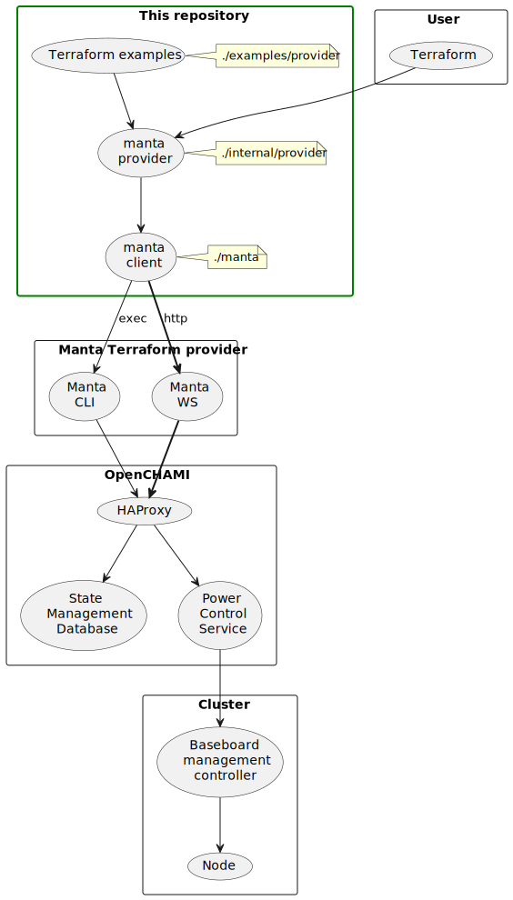
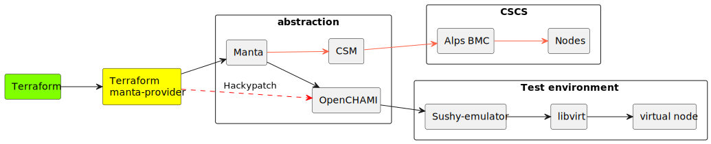

= Manta terraform provider
:toc:
:sectnums:

== Introduction

=== Context diagram

== Goal

* [x] Add a redfish endpoint in SMD
* [x] Switch the power status of a node
* [ ] Replace Manta CLI by Manta WS

== Steps

=== Development

This provider is developed using the https://developer.hashicorp.com/terraform/plugin/framework[Terraform Plugin Framework].
If you want to learn more, you can follow the https://developer.hashicorp.com/terraform/tutorials/providers-plugin-framework[Provider Plugin Framework tutorials]
in the HashiCorp website.

=== Install Provider locally

Install all dependencies and build the provider.

[source,shell]
----
go mod tidy
go install
----

After this, you should be able to find the provider's binary in your local `$GOBIN`
directory or the `bin` directory of your local `$GOPATH`. By default, this location is `$HOME/go/bin`.

=== Edit `.terraformrc` to override the source for the Manta provider

Generally, Terraform will download the provider from a Registry. In order to use a local
version of the provider, you need to tell Terraform to override the source for the provider.
This is done by creating a `.terraformrc` file in your home directory and adding the
following content:

[source,terraform]
----
provider_installation {

  dev_overrides {
      "registry.terraform.io/scitas/manta" = "<PATH>"
  }

  # For all other providers, install them directly from their origin provider
  # registries as normal. If you omit this, Terraform will _only_ use
  # the dev_overrides block, and so no other providers will be available.
  direct {}
}
----

Where `<PATH>` is the path to the directory containing the provider binary (tipically
`$HOME/go/bin/`). For more information on the `.terraformrc` file, see
https://www.terraform.io/docs/cli/config/config-file.html[the Terraform documentation].

=== Verify the provider works

You can use the files in the `examples/provider-install-verification/` directory to test the
provider.

[source,shell]
----
terraform -chdir=examples/provider-install-verification/ plan -var-file=tester.tfvars
----

== Known issue

=== Hackypatch OpenCHAMI

OpenCHAMI has a design issue: https://github.com/OpenCHAMI/power-control/issues/17[PCS and HSM have not the same power state].

Manta still in development and to keep going forward with the development of this terraform
provider, we request directly to OpenCHAMI instead of using fully Manta.  That can be an issue when
we will switch the Manta's backend to CSM.

It is the two functions that request directly OpenCHAMI:

* Get the data of the node
* Get the power status of the node

== Resources

* https://developer.hashicorp.com/terraform/tutorials/providers-plugin-framework/providers-plugin-framework-provider-configure[Configure provider client]
* https://youtu.be/noxwUVet5RE[Creating a Terraform Provider for Just About Anything] (video)
* https://developer.hashicorp.com/terraform/plugin/framework[Terraform plugin framework] (most recent protocol version 5 and 6)
* https://gitlab.com/gitlab-org/terraform-provider-gitlab[terraform-provider-gitlab]
* https://www.hashicorp.com/en/resources/creating-terraform-provider-for-anything[Creating a Terraform Provider for Just About Anything]
* https://developer.hashicorp.com/terraform/docs/partnerships[Terraform integration program]
* https://dev.to/devangtomar/how-to-write-your-own-terraform-provider-a-step-by-step-guide-g0i[How to Write Your Own Terraform Provider: A Step-by-Step Guide]
* https://github.com/cyrusjavan/terraform-provider-example[pet example]
